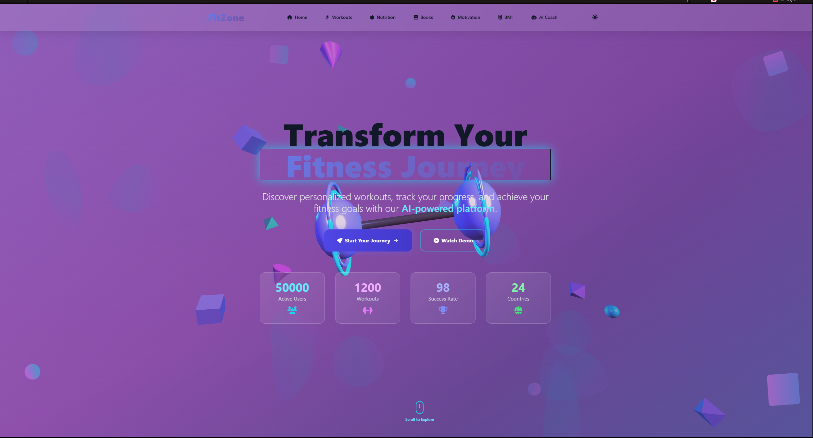
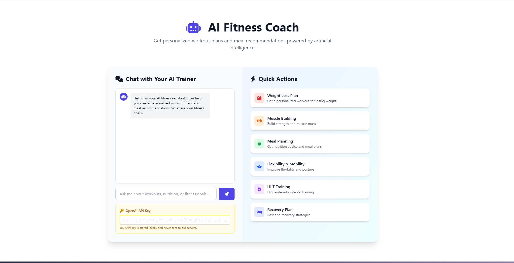
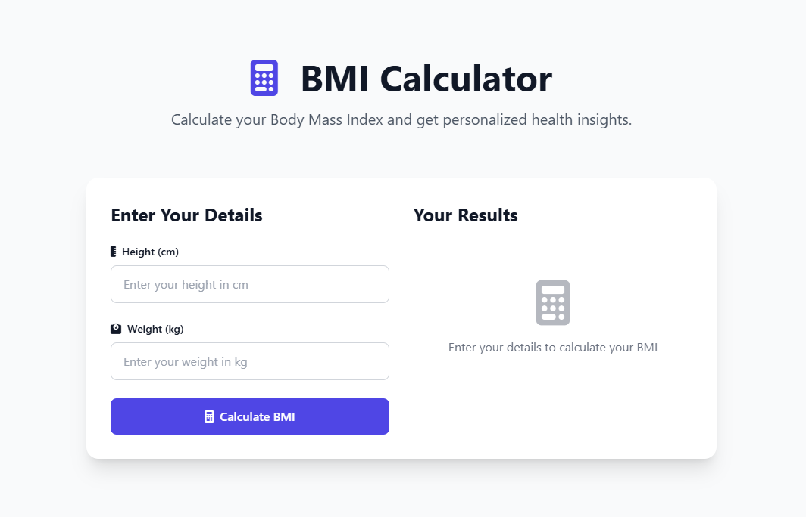

# FitZone 🏋️‍♂️

**Your Ultimate Fitness Companion**

---

## 🌟 Preview

> **See how FitZone looks!**

<p align="center">
  
  <br><em>Landing Page</em>
</p>

<p align="center">
  
  <br><em>AI Fitness Assistant</em>
</p>

<p align="center">
  
  <br><em>Fitness Tools & Progress Tracker</em>
</p>

---

## 📊 Project Stats & Insights

<p align="center">
  
  
  
  
</p>

<p align="center">
  
</p>

---

## ⭐ Star History

<p align="center">
  
</p>

---

## 🚀 Features

- **Stunning Landing Page**: Eye-catching hero section with 3D graphics and smooth animations.
- **AI Fitness Assistant**: Chat with an OpenAI-powered coach for personalized advice on workouts, nutrition, and motivation.
- **Workout Library**: Curated workout cards with embedded videos, filters, and categories (Cardio, Strength, Flexibility, HIIT, Yoga).
- **Fitness Calculators**:
  - BMI Calculator
  - Body Fat Calculator
  - Calorie Calculator
  - One Rep Max (1RM) Calculator
- **Workout Timer**: Start, pause, and reset your workout timer with quick presets and notifications.
- **Progress Tracker**: Visualize your weekly workout stats and log your progress.
- **Nutrition Tracker**: Log your meals and calories, track daily intake, and get actionable feedback.
- **Motivation Section**: Rotating motivational quotes to keep you inspired.
- **Dark/Light Theme**: Seamless theme toggle for your preferred look.
- **Responsive Design**: Fully optimized for desktop and mobile devices.

---

## 🖥️ Tech Stack

- **HTML5 & CSS3** (Tailwind CSS, Animate.css, FontAwesome)
- **JavaScript (ES6+)**
- **Three.js** (3D hero scene)
- **GSAP** (Animations)
- **OpenAI API** (AI Assistant)
- **Chart.js** (Progress charts)
- **DOMPurify & Marked** (Safe markdown rendering)

---

## 📂 Project Structure

```
fitzone/
├── index.html
├── js/
│   ├── ai-assistant.js
│   ├── animations.js
│   ├── app.js
│   ├── fitness-tools.js
│   └── three-scene.js
└── .gitignore
```

---

## ⚡ Getting Started

1. **Clone the repository:**
   ```sh
   git clone https://github.com/haxurn/fitzone.git
   cd fitzone
   ```
2. **Open `index.html` in your browser.**
   - No build step required! All dependencies are loaded via CDN.

---

## 🤖 AI Assistant Setup

- To use the AI Fitness Assistant, you need an [OpenAI API key](https://platform.openai.com/account/api-keys).
- Enter your API key in the provided input field in the AI Coach section.
- Your key is stored locally in your browser (never sent to any server except OpenAI).

---

## 📊 Fitness Tools

- **BMI, Body Fat, Calorie, and 1RM Calculators**: Enter your data and get instant results.
- **Workout Timer**: Track your workout duration with sound notifications.
- **Progress Tracker**: Visualize your weekly activity and log workouts.
- **Nutrition Tracker**: Add foods and calories, see your daily intake.

---

## 🌈 Customization & Theming

- Easily switch between dark and light mode.
- All styles are managed with Tailwind CSS and custom CSS for advanced effects.

---

## 📱 Mobile Friendly

- The UI is fully responsive and touch-optimized for mobile devices.

---

## 🛡️ Security

- All user data (API keys, progress, nutrition logs) is stored locally in your browser.
- Markdown responses from the AI are sanitized with DOMPurify.

---

## 📝 License

This project is open-source and available under the [MIT License](LICENSE).

---

## 🙌 Credits

- [OpenAI](https://openai.com/)
- [Three.js](https://threejs.org/)
- [Tailwind CSS](https://tailwindcss.com/)
- [Chart.js](https://www.chartjs.org/)
- [FontAwesome](https://fontawesome.com/)
- [Animate.css](https://animate.style/)
- [DOMPurify](https://github.com/cure53/DOMPurify)
- [Marked](https://marked.js.org/)

---

## 💡 Contributing

Pull requests are welcome! For major changes, please open an issue first to discuss what you would like to change.

---

## 📬 Contact

For questions or feedback, please open an issue or contact [samitesfaye726@gmail.com](mailto:samitesfaye726@gmail.com)

---

**Stay fit, stay motivated! 💪**
